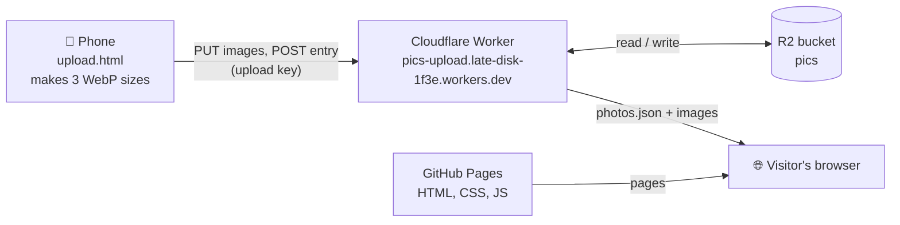

# pics

Minimal photo gallery: a random-photo page, a gallery with a full-screen viewer, and a light/dark toggle. The pages are a static site on GitHub Pages; the photos live in a Cloudflare R2 bucket and are served by a small Worker.

## Architecture



The top row is the upload path. Visitors get the pages from GitHub Pages and the photos from the Worker, which reads them from R2. Only requests carrying the upload key can write.

## How it works
- `upload.html` (not linked in the nav) uploads from your phone. It makes three WebP sizes in the browser (`thumb` 960×600, `md` 1600, `full` 2560), which strips EXIF/GPS, and sends them to the Worker with an upload key.
- The Worker (`worker/`) checks the key and the files, writes them to the private R2 bucket `pics`, and adds the photo to `photos.json` (newest first). It rejects any WebP that still carries EXIF or XMP.
- The gallery and random pages load `photos.json` and the images from the Worker (set as `BASE` in `assets/js/photos.js`). Photos are live as soon as the upload finishes.
- `npm run build` copies the pages and assets to `_site/` and renders the icons. Each push to `main` runs `.github/workflows/deploy.yml`, which builds and deploys to Pages. Deploys only happen when code changes.

### Bucket layout

| Key | Contents | Cache-Control |
| --- | --- | --- |
| `img/thumb/<id>.webp` | Fits inside 960 × 600, quality 78 | `public, max-age=31536000, immutable` |
| `img/md/<id>.webp` | Fits inside 1600 × 1600, quality 82 | same |
| `img/full/<id>.webp` | Fits inside 2560 × 2560, quality 85 | same |
| `photos.json` | `[{ id, w, h, t }]`, newest first | `no-cache` |

An id is the capture timestamp, a random suffix and the first 8 hex characters of the full-size file's SHA-256, e.g. `20261004-110313-271e-3fa91c02`. An id never points to different bytes, which is what makes the one-year cache safe.

### Worker API

| Route | Key needed | What it does |
| --- | --- | --- |
| `GET /photos.json` | No | Serves the manifest |
| `GET /img/{size}/{id}.webp` | No | Serves one image |
| `GET /api/ping` | Yes | Checks the key (204 or 401) |
| `PUT /api/img/{size}/{id}.webp` | Yes | Validates and stores one WebP |
| `POST /api/photos` | Yes | Adds `{id, w, h, t}` to the manifest once all three sizes exist |
| `DELETE /api/photos/{id}` | Yes | Removes the manifest entry and the three files |

## Local development
```sh
npm install
npm run dev   # build + serve on http://localhost:3000, using the live photos from the Worker
```

Worker:
```sh
cd worker
npm install
npx wrangler dev      # local Worker
npx wrangler deploy   # publish to pics-upload.late-disk-1f3e.workers.dev
```

Pushing to `main` deploys the pages only. Changes in `worker/` go live when you run `npx wrangler deploy`.

## One-time setup
1. **Repo:** create `RenRMT/pics-gallery` (must be public for free Pages) and push this folder to `main`.
2. **Pages:** go to Settings → Pages → Source: **GitHub Actions**.
3. **Domain:** nothing to set here. As a project site, the gallery is served under the user site's custom domain at `https://rendata.nl/pics-gallery/` (domain, DNS and HTTPS are configured in `RenRMT.github.io`).
4. **Origins:** `ALLOWED_ORIGINS` in `worker/wrangler.jsonc` must list the origin the gallery is served from (`https://rendata.nl`). If the domain ever changes, update it and run `npx wrangler deploy`, or the gallery can't load `photos.json`.
5. *(Optional)* To give the gallery its own subdomain instead, add `CNAME  pics  →  renrmt.github.io` at the DNS provider, set `pics.rendata.nl` as the custom domain in this repo's Settings → Pages, and add `https://pics.rendata.nl` to `ALLOWED_ORIGINS`.
6. **Bucket:** in Cloudflare → R2, create the bucket `pics` (keep it private) and seed it with an empty manifest:
   ```sh
   echo [] > photos.json
   npx wrangler r2 object put pics/photos.json --file photos.json --content-type application/json --cache-control no-cache --remote
   ```
7. **Worker:** in `worker/`, run `npm install` and `npx wrangler login`. Then run `npx wrangler secret put UPLOAD_KEY` with a key from `node -e "console.log(require('crypto').randomBytes(32).toString('hex'))"`, and finally `npx wrangler deploy`. Allowed page origins are in `ALLOWED_ORIGINS` in `worker/wrangler.jsonc`.
8. **Phone:** open `https://rendata.nl/pics-gallery/upload.html` in Vanadium (or another Chromium browser; it needs WebP encoding) and paste the upload key. Optionally, use ⋮ → *Add to Home screen* so it opens like an app.

## Adding and removing photos
- **Add:** use the upload page. Failed photos keep their preview; tap Upload again to retry just those.
- **Remove:** `curl -X DELETE -H "Authorization: Bearer $UPLOAD_KEY" https://pics-upload.late-disk-1f3e.workers.dev/api/photos/<id>`. The id is in `photos.json` and in the image URLs.
- **Rotate the key:** run `npx wrangler secret put UPLOAD_KEY` with a new value and paste it on your phone. The old key stops working immediately.
- Everything in the `pics` bucket is public through the Worker. Never put originals or anything private there.
